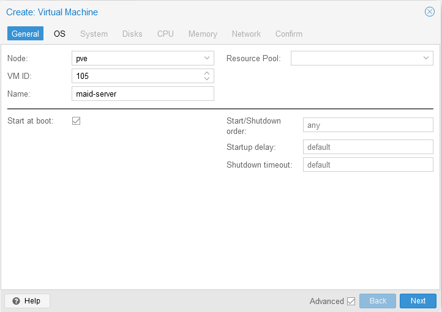
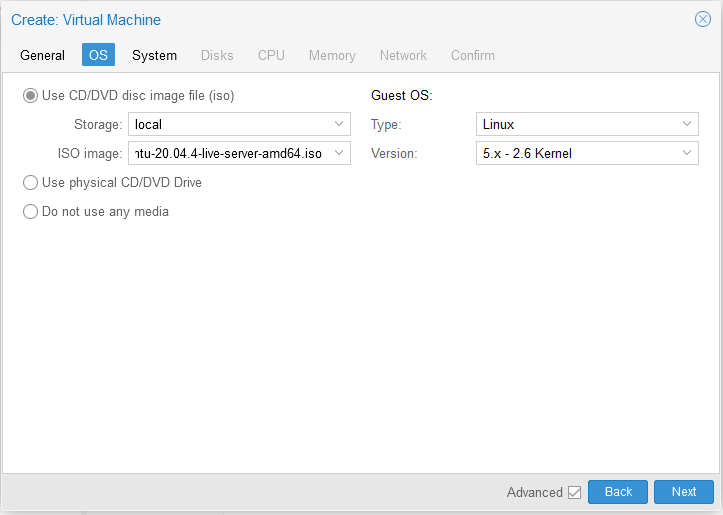
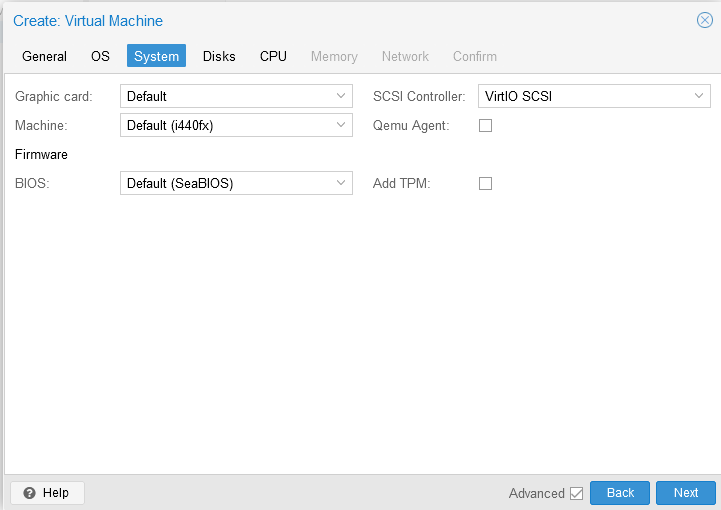
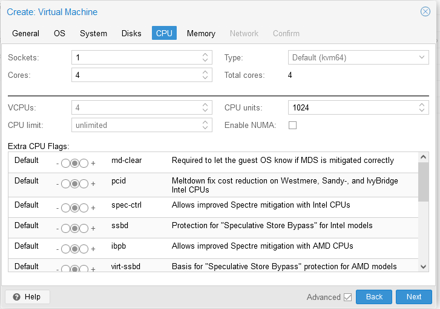
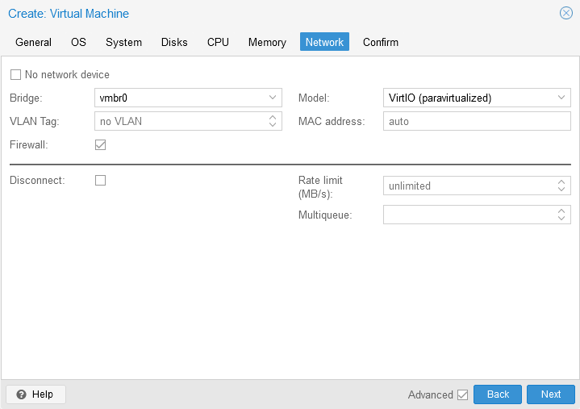
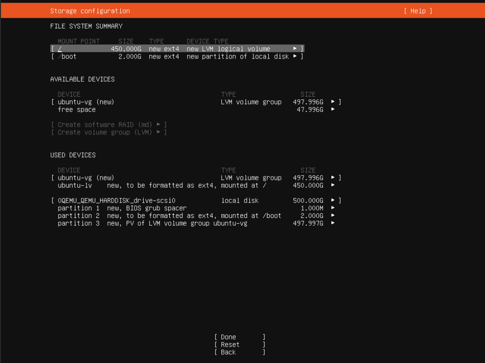

# Setting up MAID VM

## Install Proxmox on the server

## Create a LVM Thin Pool on the hard drive

## Create a new VM

Settings are as follows:

## Install Ubuntu

* Use the following partitioning:

* Install docker if prompted.
* Allow SSH
* Reboot
* `sudo apt update && sudo apt upgrade`
* In router: change IP address to `192.168.123.4`
* Install guest agent:
  * `sudo apt install qemu-guest-agent`
  * in proxmox: activate guest agent under options

## Setup Ubuntu

### Configure SSH

* To recreate possible offending keys run `ssh-keygen -R 192.168.123.4` on the client side
* Upload your public key:
  * In Windows PowerShell ([source](https://www.chrisjhart.com/Windows-10-ssh-copy-id/)): `type $env:USERPROFILE\.ssh\id_rsa.pub | ssh gain@192.168.123.4 "cat >> .ssh/authorized_keys"`
  * Under Linux use `copy-id`
